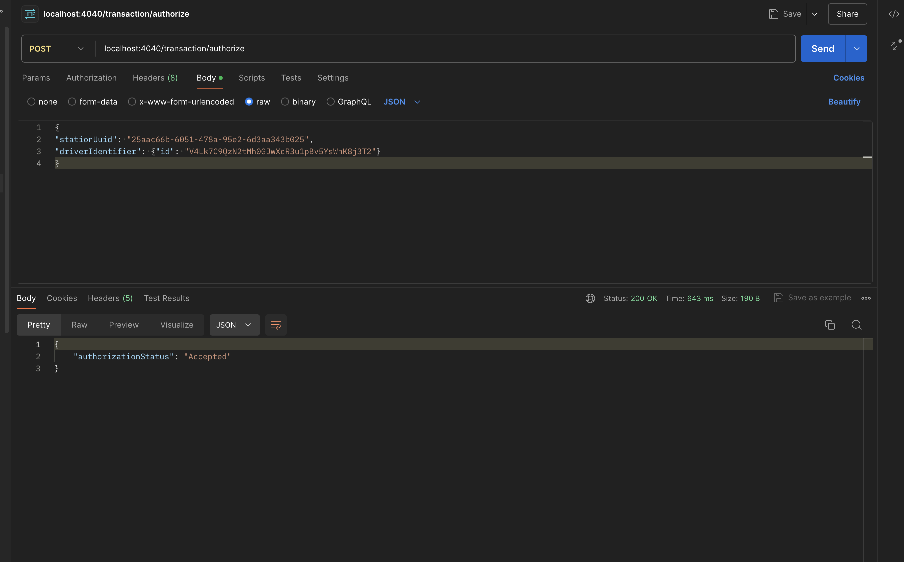

# CSMS

[](LICENSE)
[](https://travis-ci.org/username/repo)
[](https://github.com/username/repo/issues)

## Table of Contents

- [CSMS](#CSMS)
    - [About](#about)
    - [Architecture](#architecture)
    - [Getting Started](#getting-started)
        - [Prerequisites](#prerequisites)
        - [Installation](#installation)
    - [Usage](#usage)


## About

ChargePoint assignment. Consists of two services that are used to authenticate a user 
for charging a car.

## Architecture
Application consists of two separate services, transaction_service and authentication_service are in their sub folders respectively.
Docker compose is used to instantiate all dependent services like kafka.  
Wait for it is used to wait for kafka startup before initializing main services 
## Limitations/Assumptions
Invalid Case means  -- Identifier is invalid. Does not meet the identifier length requirements<br>
Unknown Case means -- Identifier is valid but not present/registered in the system<br>
Initial Start up for docker-compose up --build command might take about 2 min.<br>
As the request is being sent by charging station, its assumed that the guid will be valid. But code could be added for this. 


## Getting Started

### Prerequisites

```sh
Postman - For ease of testing
MAC - Great to have, but not necessary
Docker version 25.0.3
Docker Compose version v2.24.5-desktop.1
```
Project is developed using IntelliJ Idea Community Edition. 
Could be opened at the root (CSMS) level using IntelliJ. But not necessary<br>


### installation
```dockerfile
git clone https://github.com/tushru2004/CSMS.git
cd CSMS
docker-compose up --build
# Give 2 min for services to start up. Might be longer depending on internet speed and processor speed
```
### Usage
### Accepted case -- User valid and card works

```
curl --location 'localhost:4040/transaction/authorize' \
--header 'Content-Type: application/json' \
--data '{
"stationUuid": "25aac66b-6051-478a-95e2-6d3aa343b025",
"driverIdentifier": {"id": "V4Lk7C9QzN2tMh0GJwXcR3u1pBv5YsWnK8j3T2"}
}'
```


### Rejected -- Card doesn't work
```
curl --location 'localhost:4040/transaction/authorize' \
--header 'Content-Type: application/json' \
--data '{
"stationUuid": "25aac66b-6051-478a-95e2-6d3aa343b025",
"driverIdentifier": {"id": "xY4B8zP0mN5qKdL2Hf9Z"}
}'
```


### Unknown -- Identifier is valid but not present/registered in the system
```
curl --location 'localhost:4040/transaction/authorize' \
--header 'Content-Type: application/json' \
--data '{
"stationUuid": "25aac66b-6051-478a-95e2-6d3aa343b025",
"driverIdentifier": {"id": "ZLLk7C9QzN2tMh0GJwXcR3u1pBv5YsWfnK8j3RT"}
}'
```


### Invalid -- Identifier is invalid. Does not meet the identifier length requirements
```
curl --location 'localhost:4040/transaction/authorize' \
--header 'Content-Type: application/json' \
--data '{
"stationUuid": "25aac66b-6051-478a-95e2-6d3aa343b025",
"driverIdentifier": {"id": "tt34235"}
}'
```

